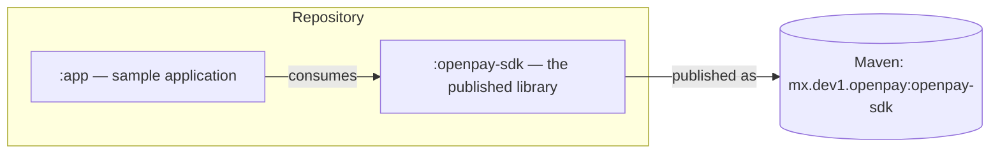
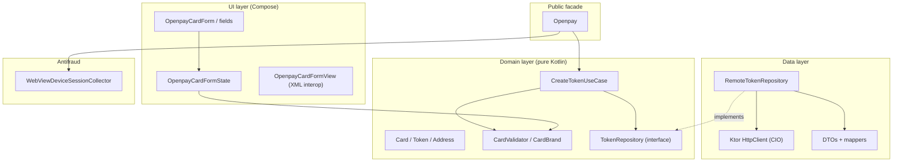
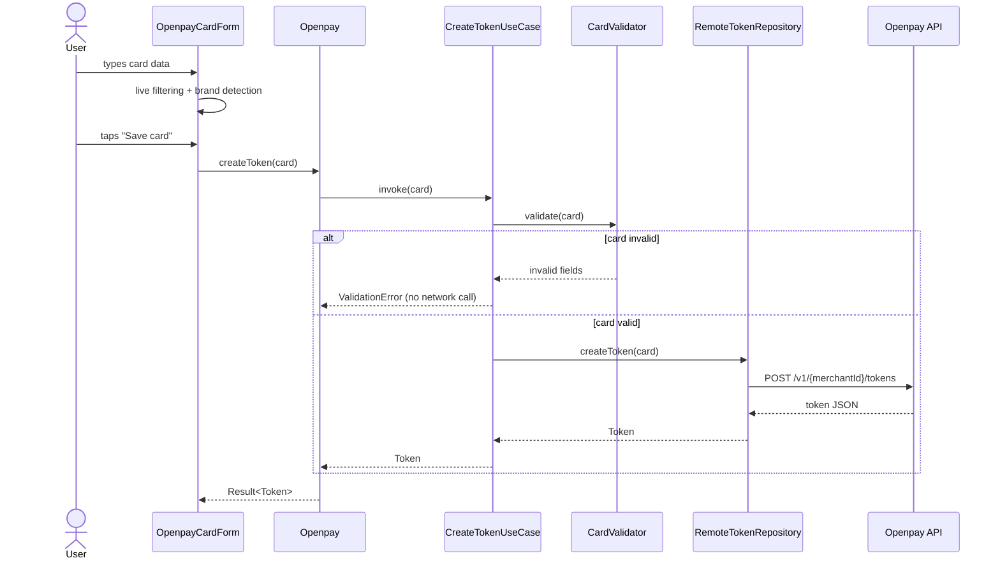
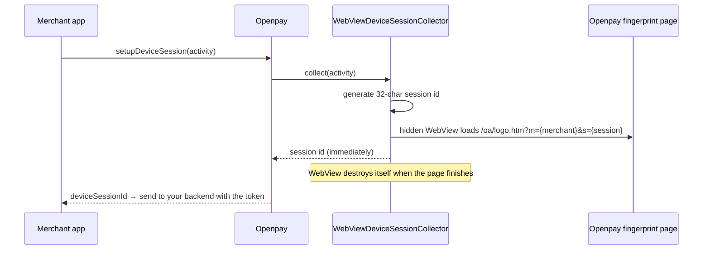

# Architecture

The SDK follows **clean architecture**: the domain rules sit at the center
and never depend on Android, the network or any framework. Outer layers
depend inward, which keeps the business logic testable in plain JVM tests.

## Modules

- **`:openpay-sdk`** — everything a merchant app needs: networking,
  tokenization, validation, antifraud, Compose UI and translations.
- **`:app`** — a runnable sample that demonstrates every SDK feature.

## Layers inside the SDK

Key rules:

- The **domain layer** (`domain/`) has no Android imports. `CardValidator`
  and `CreateTokenUseCase` run in milliseconds on any JVM.
- The **data layer** (`data/`) implements the domain interfaces using Ktor
  and kotlinx.serialization. Swapping the HTTP stack would touch only this
  layer.
- The **UI layer** (`ui/`) is Compose-first. The XML wrapper exists purely
  for legacy host apps.
- **Koin** wires everything inside an *isolated* container
  (`OpenpayKoinContext`), so the SDK never conflicts with a host app that
  also uses Koin.

## Tokenization flow

## Antifraud flow

## Package map

| Package | Contents |
|---|---|
| `mx.dev1.openpay.sdk` | `Openpay` facade, `OpenpayCallback`, `OpenpaySdk` |
| `...sdk.core` | `OpenpayConfig`, countries, environments, `OpenpayException` |
| `...sdk.domain.model` | `Card`, `Token`, `TokenizedCard`, `Address` |
| `...sdk.domain.validation` | `CardValidator`, `CardBrand`, `CardValidationResult` |
| `...sdk.domain.usecase` / `repository` | `CreateTokenUseCase`, `TokenRepository` |
| `...sdk.data` | Ktor client factory, DTOs, mappers, `RemoteTokenRepository` |
| `...sdk.antifraud` | Device session collection |
| `...sdk.ui` | Theme, form, fields, visual transformations, XML view |
| `...sdk.i18n` | `OpenpayLanguage`, `OpenpayLocale` override |
| `...sdk.di` | Koin modules and the isolated container |
