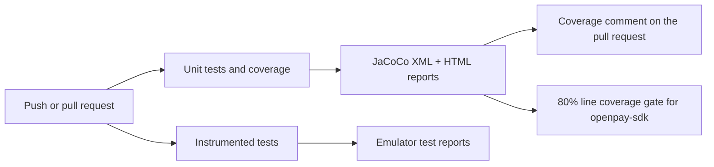

# Continuous integration

The repository runs a GitHub Actions pipeline (`.github/workflows/ci.yml`) on every push and pull request that targets `develop` or `master`. You do not need to install anything: GitHub runs it automatically when you open a pull request.

## What the pipeline does



### Unit tests and coverage

This job runs on every push and pull request:

1. Compiles the project with JDK 17 and runs `testDebugUnitTest` for every module.
2. Generates JaCoCo coverage reports (`jacocoTestReport`).
3. Enforces the 80% line coverage minimum on `openpay-sdk` (`jacocoCoverageVerification`). The build fails when coverage drops below that threshold.
4. On pull requests, posts (and keeps updated) a comment with the overall coverage and the coverage of the files changed by the pull request, using [Madrapps/jacoco-report](https://github.com/Madrapps/jacoco-report).
5. Uploads the HTML coverage and test reports as build artifacts, so you can download and browse them from the run page.

### Instrumented tests

This job boots an Android 14 (API 34) emulator on the runner and executes `connectedDebugAndroidTest`. The emulator needs hardware acceleration, which is why the job enables KVM before starting it. Test reports are uploaded as artifacts.

## Reading the coverage comment

Every pull request receives a single comment titled **Unit test coverage** that is refreshed on each push. It shows:

- **Overall coverage** of the project, marked with ✅ when it is at or above 80%.
- **Coverage of changed files**, so reviewers can see whether the new code is tested without opening the full report.

## Running the same checks locally

```bash
./gradlew testDebugUnitTest jacocoTestReport :openpay-sdk:jacocoCoverageVerification
./gradlew connectedDebugAndroidTest   # requires a device or emulator
```

The HTML report is generated at `<module>/build/reports/jacoco/jacocoTestReport/html/index.html`.