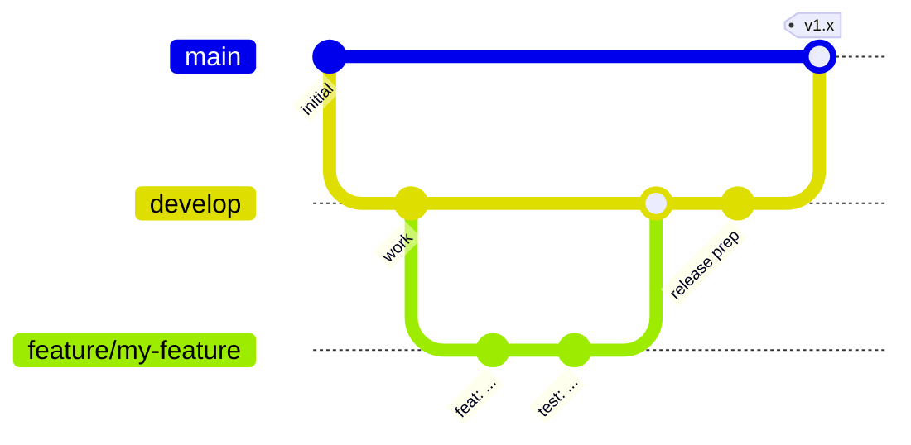

# Contributing

This guide assumes **no Android experience**. Follow it top to bottom and
you will be able to build, test and propose changes.

## 1. Set up your machine

1. Install [Android Studio](https://developer.android.com/studio) (it
   bundles the JDK and the Android SDK).
2. Clone the repository:
   ```bash
   git clone git@github.com:DEV1-Softworks/openpay-android.git
   cd openpay-android
   ```
3. Open the folder in Android Studio and let it sync, or work entirely
   from the terminal with the commands below. The project downloads its own
   Gradle and JDK toolchain automatically on first build.

## 2. Everyday commands

| What | Command |
|---|---|
| Build everything | `./gradlew assembleDebug` |
| Run all unit tests | `./gradlew testDebugUnitTest` |
| Coverage report (HTML + XML) | `./gradlew :openpay-sdk:jacocoTestReport` |
| Enforce the 80% coverage gate | `./gradlew :openpay-sdk:jacocoCoverageVerification` |
| Install the sample app on a device | `./gradlew :app:installDebug` |
| Publish the SDK to your local Maven | `./gradlew :openpay-sdk:publishToMavenLocal` |

The coverage report lands in
`openpay-sdk/build/reports/jacoco/jacocoTestReport/html/index.html` — open
it in a browser.

## 3. Project rules

- **Language**: Kotlin only. UI is Jetpack Compose; XML exists only for
  legacy interop.
- **Architecture**: clean architecture. Domain code
  (`openpay-sdk/src/main/kotlin/.../domain`) must not import Android or
  Ktor types.
- **Dependency injection**: Koin. SDK definitions live in `di/` modules
  inside the isolated `OpenpayKoinContext`.
- **Versions**: every dependency version lives in
  `gradle/libs.versions.toml`, nowhere else.
- **Naming**: no ambiguous names. Loop counters are the only exception.
- **Tests**: every change ships with unit tests (JUnit + Mockito +
  Robolectric). Line coverage must stay at **80% or above** — the
  `jacocoCoverageVerification` task fails otherwise. Run the tests before
  every commit.

## 4. Git workflow (Git Flow)



- `master` is **production**. Nothing is pushed to it directly.
- `develop` is the integration branch and the base of every feature.
- Create a branch per feature: `feature/<short-name>`.
- Open a **pull request to `develop`** for every change, small PRs over
  big ones. A PR must build and pass `testDebugUnitTest` +
  `jacocoCoverageVerification`.
- Releases merge `develop` into `master` through a release PR.

## 5. Pull request checklist

- [ ] Code follows the architecture and naming rules above
- [ ] New/changed code has tests, coverage ≥ 80%
- [ ] `./gradlew testDebugUnitTest jacocoCoverageVerification` passes locally
- [ ] User-facing SDK strings exist in **all four** languages
      (`values`, `values-es`, `values-pt`, `values-fr`)
- [ ] Documentation updated (all four languages under `docs/`)
