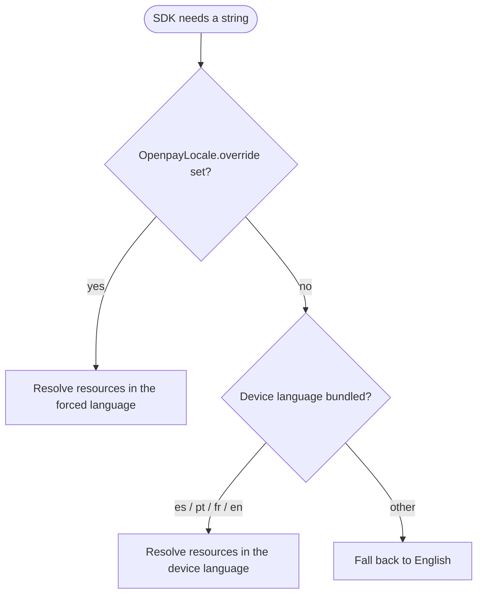

# Internationalization

Every text the SDK shows — labels, validation errors, accessibility
descriptions — is available in:

| Language | Tag |
|---|---|
| English (default and fallback) | `en` |
| Spanish | `es` |
| Portuguese | `pt` |
| French | `fr` |

## Automatic resolution

By default the SDK follows the **device language**, including regional
variants (`es-MX`, `pt-BR`, `fr-CA`, …). Devices set to any other language
fall back to English. There is nothing to configure.

## Forcing a language

Some apps let users pick a language independently of the system settings.
Set the override once and every SDK component on screen updates
immediately:

```kotlin
import mx.dev1.openpay.sdk.i18n.OpenpayLanguage
import mx.dev1.openpay.sdk.i18n.OpenpayLocale

OpenpayLocale.override = OpenpayLanguage.PORTUGUESE // force Portuguese
OpenpayLocale.override = null                       // back to automatic
```

The override is observable Compose state: SDK composables recompose live
when it changes, no restart needed.

## View-based apps

If you show SDK strings from your own view code, resolve them through a
localized context:

```kotlin
val localizedContext = OpenpayLocale.localize(context)
val label = localizedContext.getString(R.string.openpay_card_number_label)
```

`localize` returns the context untouched when no override is set.

## Flow



## Adding a language

Translations live in the SDK's Android resources
(`openpay-sdk/src/main/res/values-<tag>/strings.xml`). To propose a new
language, copy `values/strings.xml`, translate every entry, add the tag to
`OpenpayLanguage` and open a pull request — see
[Contributing](contributing.md).
