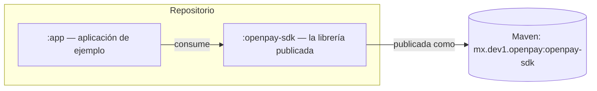
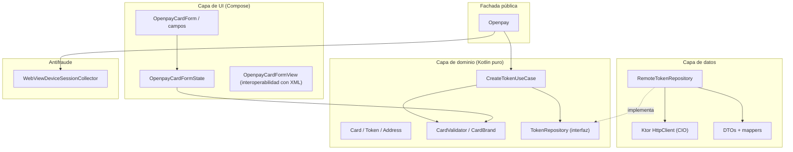
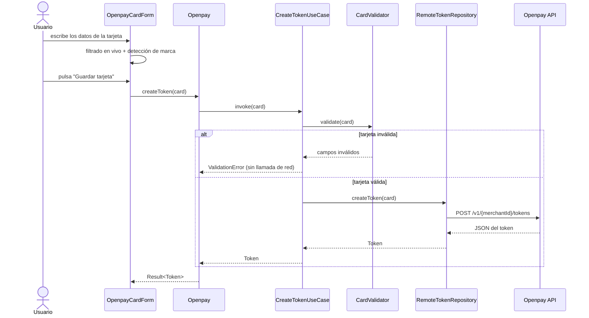
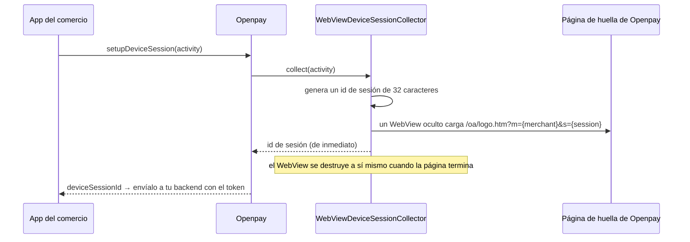

# Arquitectura

El SDK sigue la **arquitectura limpia**: las reglas de dominio están en el
centro y nunca dependen de Android, de la red ni de ningún framework. Las
capas externas dependen hacia adentro, lo que mantiene la lógica de negocio
testeable en pruebas de JVM puras.

## Módulos

- **`:openpay-sdk`** — todo lo que necesita la app de un comercio: red,
  tokenización, validación, antifraude, UI de Compose y traducciones.
- **`:app`** — un ejemplo ejecutable que demuestra cada funcionalidad del
  SDK.

## Capas dentro del SDK

Reglas clave:

- La **capa de dominio** (`domain/`) no tiene imports de Android.
  `CardValidator` y `CreateTokenUseCase` se ejecutan en milisegundos en
  cualquier JVM.
- La **capa de datos** (`data/`) implementa las interfaces del dominio
  usando Ktor y kotlinx.serialization. Cambiar el stack HTTP tocaría solo
  esta capa.
- La **capa de UI** (`ui/`) es Compose-first. El wrapper de XML existe
  únicamente para apps anfitrionas legadas.
- **Koin** conecta todo dentro de un contenedor *aislado*
  (`OpenpayKoinContext`), de modo que el SDK nunca entra en conflicto con
  una app anfitriona que también use Koin.

## Flujo de tokenización

## Flujo antifraude

## Mapa de paquetes

| Paquete | Contenido |
|---|---|
| `mx.dev1.openpay.sdk` | Fachada `Openpay`, `OpenpayCallback`, `OpenpaySdk` |
| `...sdk.core` | `OpenpayConfig`, países, entornos, `OpenpayException` |
| `...sdk.domain.model` | `Card`, `Token`, `TokenizedCard`, `Address` |
| `...sdk.domain.validation` | `CardValidator`, `CardBrand`, `CardValidationResult` |
| `...sdk.domain.usecase` / `repository` | `CreateTokenUseCase`, `TokenRepository` |
| `...sdk.data` | Fábrica del cliente Ktor, DTOs, mappers, `RemoteTokenRepository` |
| `...sdk.antifraud` | Recolección de la sesión de dispositivo |
| `...sdk.ui` | Tema, formulario, campos, transformaciones visuales, vista XML |
| `...sdk.i18n` | `OpenpayLanguage`, override de `OpenpayLocale` |
| `...sdk.di` | Módulos de Koin y el contenedor aislado |
