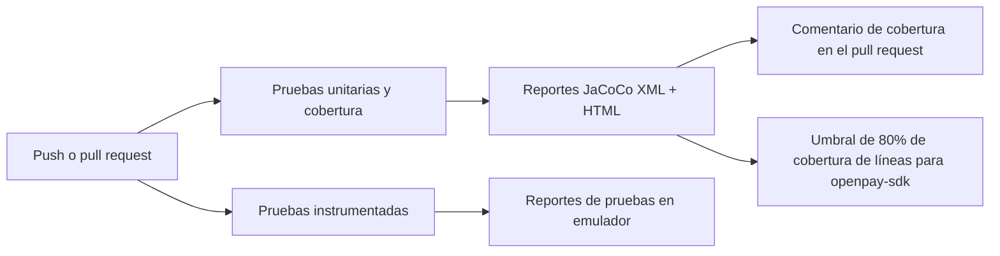
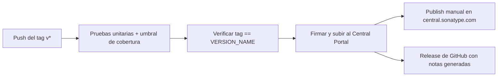

# Integración continua

El repositorio ejecuta un pipeline de GitHub Actions (`.github/workflows/ci.yml`) en cada push y pull request dirigidos a `develop` o `master`. No necesitas instalar nada: GitHub lo ejecuta automáticamente cuando abres un pull request.

## Qué hace el pipeline



### Pruebas unitarias y cobertura

Este job se ejecuta en cada push y pull request:

1. Compila el proyecto con JDK 17 y ejecuta `testDebugUnitTest` en todos los módulos.
2. Genera los reportes de cobertura de JaCoCo (`jacocoTestReport`).
3. Aplica el mínimo de 80% de cobertura de líneas en `openpay-sdk` (`jacocoCoverageVerification`). El build falla cuando la cobertura queda por debajo de ese umbral.
4. En los pull requests publica (y mantiene actualizado) un comentario con la cobertura general y la cobertura de los archivos modificados por el pull request, usando [Madrapps/jacoco-report](https://github.com/Madrapps/jacoco-report).
5. Sube los reportes HTML de cobertura y de pruebas como artefactos del build, para que puedas descargarlos y revisarlos desde la página de la ejecución.

### Pruebas instrumentadas

Este job arranca un emulador de Android 14 (API 34) en el runner y ejecuta `connectedDebugAndroidTest`. El emulador necesita aceleración por hardware, por eso el job habilita KVM antes de iniciarlo. Los reportes de pruebas se suben como artefactos.

## Cómo leer el comentario de cobertura

Cada pull request recibe un único comentario titulado **Unit test coverage** que se actualiza en cada push. Muestra:

- **Cobertura general** del proyecto, marcada con ✅ cuando está en 80% o más.
- **Cobertura de los archivos modificados**, para que quienes revisan vean si el código nuevo está probado sin abrir el reporte completo.

## Ejecutar las mismas verificaciones en local

```bash
./gradlew testDebugUnitTest jacocoTestReport :openpay-sdk:jacocoCoverageVerification
./gradlew connectedDebugAndroidTest   # requiere un dispositivo o emulador
```

El reporte HTML se genera en `<módulo>/build/reports/jacoco/jacocoTestReport/html/index.html`.

## Despliegue continuo

Un segundo workflow (`.github/workflows/cd.yml`) libera la librería a
Maven Central. Se ejecuta cuando se hace push de un tag de versión
(`v1.2.3`) — normalmente el tag del commit de merge de un release en
`master` — y también puede iniciarse manualmente desde la pestaña Actions.



1. **Primero las pruebas** — el release se bloquea si las pruebas
   unitarias o el umbral de cobertura del 80% fallan.
2. **Guarda de versión** — el workflow falla si el tag no coincide con
   `VERSION_NAME` en `gradle.properties`, así un release mal etiquetado no
   puede salir.
3. **Subida firmada** — los artefactos se firman con PGP y se suben al
   área de staging del Central Portal de Sonatype. Las credenciales y la
   llave de firma vienen de los secretos del repositorio
   (`MAVEN_REPOSITORY_USERNAME`, `MAVEN_REPOSITORY_PASSWORD`,
   `SIGNING_KEY`, `SIGNING_PASSWORD`); nunca viven en el repositorio.
4. **Confirmación manual** — nada se hace público automáticamente: una
   persona mantenedora debe presionar **Publish** sobre el despliegue
   validado en [central.sonatype.com](https://central.sonatype.com). El
   resumen de la ejecución enlaza el paso.
5. Se crea un release de GitHub con notas generadas para el tag.