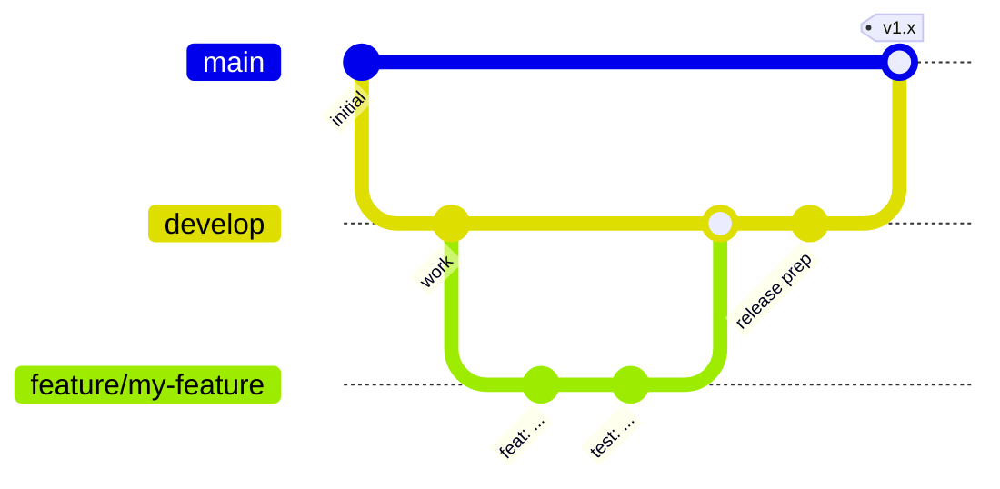

# Contribuir

Esta guía asume que **no tienes experiencia en Android**. Síguela de
principio a fin y podrás compilar, probar y proponer cambios.

## 1. Prepara tu máquina

1. Instala [Android Studio](https://developer.android.com/studio) (incluye
   el JDK y el SDK de Android).
2. Clona el repositorio:
   ```bash
   git clone git@github.com:DEV1-Softworks/openpay-android.git
   cd openpay-android
   ```
3. Abre la carpeta en Android Studio y deja que sincronice, o trabaja por
   completo desde la terminal con los comandos de abajo. El proyecto
   descarga automáticamente su propio toolchain de Gradle y JDK en la
   primera compilación.

## 2. Comandos del día a día

| Qué | Comando |
|---|---|
| Compilar todo | `./gradlew assembleDebug` |
| Ejecutar todas las pruebas unitarias | `./gradlew testDebugUnitTest` |
| Reporte de cobertura (HTML + XML) | `./gradlew :openpay-sdk:jacocoTestReport` |
| Verificar el umbral de cobertura del 80% | `./gradlew :openpay-sdk:jacocoCoverageVerification` |
| Instalar la app de ejemplo en un dispositivo | `./gradlew :app:installDebug` |
| Publicar el SDK en tu Maven local | `./gradlew :openpay-sdk:publishToMavenLocal` |

El reporte de cobertura se genera en
`openpay-sdk/build/reports/jacoco/jacocoTestReport/html/index.html` — ábrelo
en un navegador.

## 3. Reglas del proyecto

- **Lenguaje**: solo Kotlin. La UI es Jetpack Compose; el XML existe solo
  para interoperabilidad con código legado.
- **Arquitectura**: arquitectura limpia. El código de dominio
  (`openpay-sdk/src/main/kotlin/.../domain`) no debe importar tipos de
  Android ni de Ktor.
- **Inyección de dependencias**: Koin. Las definiciones del SDK viven en
  módulos `di/` dentro del contenedor aislado `OpenpayKoinContext`.
- **Versiones**: toda versión de dependencia vive en
  `gradle/libs.versions.toml`, en ningún otro lugar.
- **Nombres**: sin nombres ambiguos. Los contadores de bucles son la única
  excepción.
- **Pruebas**: todo cambio se entrega con pruebas unitarias (JUnit +
  Mockito + Robolectric). La cobertura de líneas debe mantenerse en **80% o
  más** — de lo contrario, la tarea `jacocoCoverageVerification` falla.
  Ejecuta las pruebas antes de cada commit.

## 4. Flujo de trabajo de Git (Git Flow)



- `master` es **producción**. Nada se envía a ella directamente.
- `develop` es la rama de integración y la base de cada funcionalidad.
- Crea una rama por funcionalidad: `feature/<nombre-corto>`.
- Abre un **pull request hacia `develop`** por cada cambio; PRs pequeños
  antes que grandes. Un PR debe compilar y pasar `testDebugUnitTest` +
  `jacocoCoverageVerification`.
- Los releases fusionan `develop` en `master` mediante un PR de release.

## 5. Lista de verificación del pull request

- [ ] El código sigue las reglas de arquitectura y de nombres de arriba
- [ ] El código nuevo o modificado tiene pruebas, cobertura ≥ 80%
- [ ] `./gradlew testDebugUnitTest jacocoCoverageVerification` pasa localmente
- [ ] Las cadenas del SDK visibles para el usuario existen en **los cuatro**
      idiomas (`values`, `values-es`, `values-pt`, `values-fr`)
- [ ] Documentación actualizada (los cuatro idiomas bajo `docs/`)
