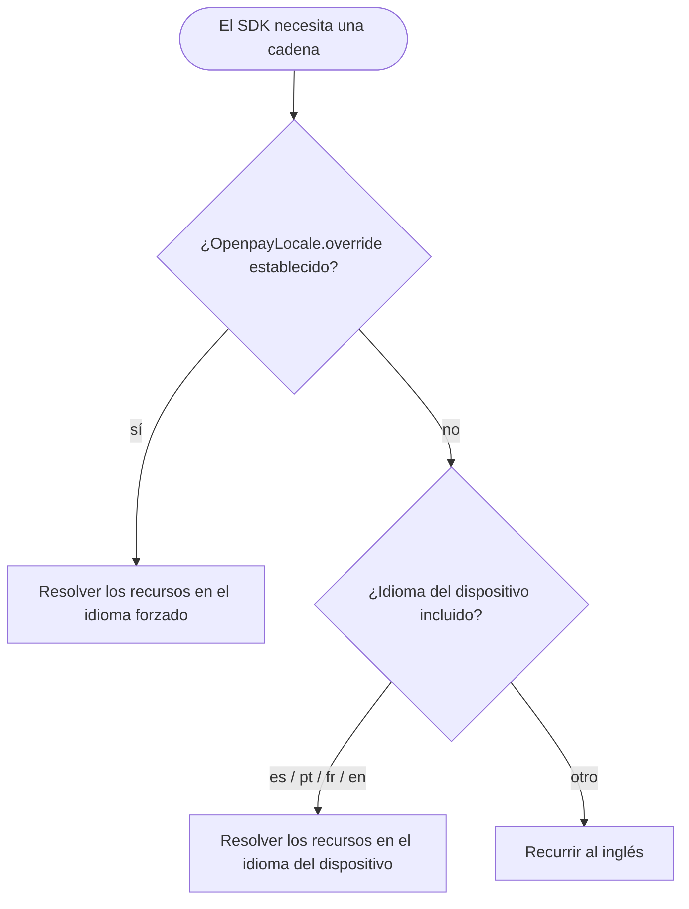

# Internacionalización

Todo texto que muestra el SDK — etiquetas, errores de validación,
descripciones de accesibilidad — está disponible en:

| Idioma | Etiqueta |
|---|---|
| Inglés (predeterminado y de respaldo) | `en` |
| Español | `es` |
| Portugués | `pt` |
| Francés | `fr` |

## Resolución automática

De forma predeterminada el SDK sigue el **idioma del dispositivo**,
incluidas las variantes regionales (`es-MX`, `pt-BR`, `fr-CA`, …). Los
dispositivos configurados en cualquier otro idioma recurren al inglés. No
hay nada que configurar.

## Forzar un idioma

Algunas apps permiten a los usuarios elegir un idioma independientemente de
la configuración del sistema. Establece el override una vez y todos los
componentes del SDK en pantalla se actualizan de inmediato:

```kotlin
import mx.dev1.openpay.sdk.i18n.OpenpayLanguage
import mx.dev1.openpay.sdk.i18n.OpenpayLocale

OpenpayLocale.override = OpenpayLanguage.PORTUGUESE // forzar portugués
OpenpayLocale.override = null                       // volver a automático
```

El override es estado observable de Compose: los composables del SDK se
recomponen en vivo cuando cambia, sin necesidad de reiniciar.

## Apps basadas en vistas

Si muestras cadenas del SDK desde tu propio código de vistas, resuélvelas a
través de un contexto localizado:

```kotlin
val localizedContext = OpenpayLocale.localize(context)
val label = localizedContext.getString(R.string.openpay_card_number_label)
```

`localize` devuelve el contexto sin cambios cuando no hay ningún override
establecido.

## Flujo



## Agregar un idioma

Las traducciones viven en los recursos de Android del SDK
(`openpay-sdk/src/main/res/values-<tag>/strings.xml`). Para proponer un
nuevo idioma, copia `values/strings.xml`, traduce cada entrada, agrega la
etiqueta a `OpenpayLanguage` y abre un pull request — ver
[Contribuir](contributing.md).
