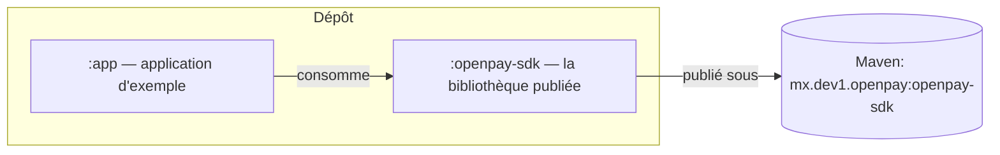
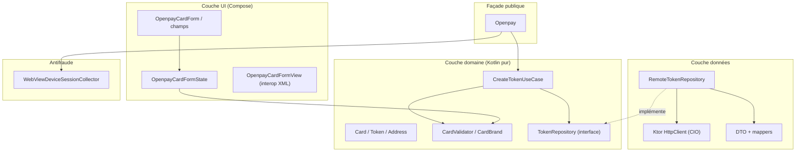
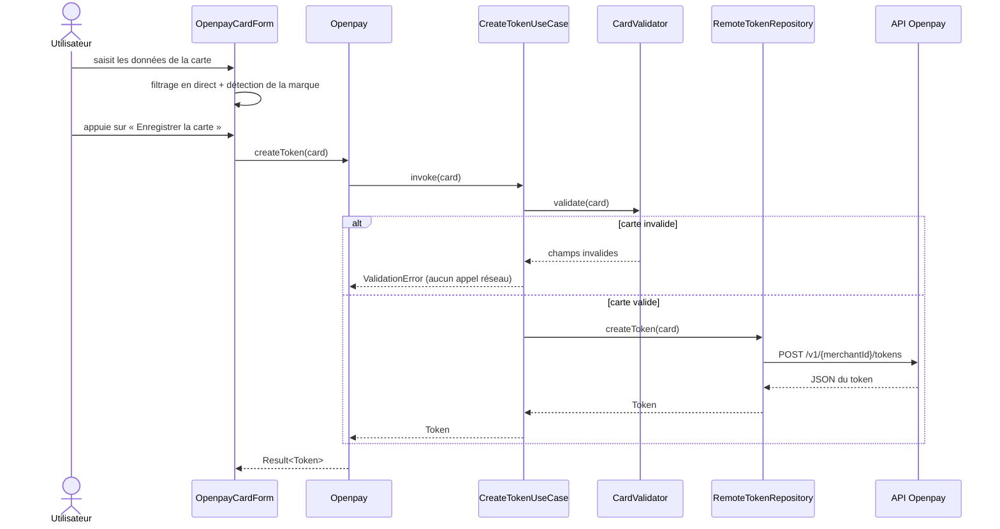
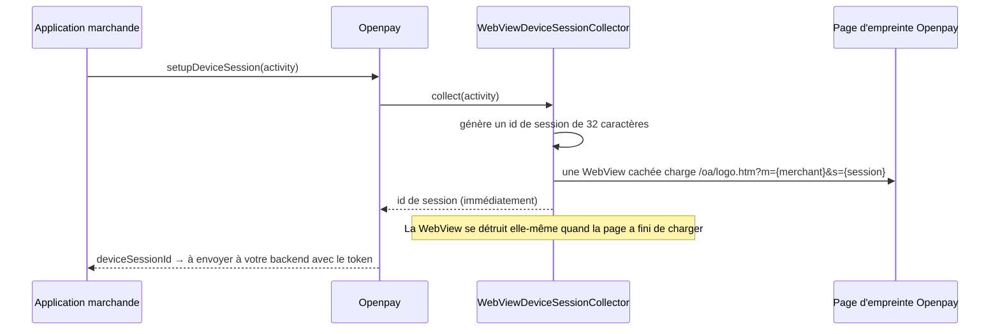

# Architecture

Le SDK suit les principes de la **clean architecture** : les règles du
domaine sont au centre et ne dépendent jamais d'Android, du réseau ni
d'aucun framework. Les couches externes dépendent vers l'intérieur, ce qui
garde la logique métier testable dans de simples tests JVM.

## Modules

- **`:openpay-sdk`** — tout ce dont une application marchande a besoin :
  réseau, tokenisation, validation, antifraude, interface Compose et
  traductions.
- **`:app`** — un exemple exécutable qui illustre chaque fonctionnalité du
  SDK.

## Couches à l'intérieur du SDK

Règles clés :

- La **couche domaine** (`domain/`) ne contient aucun import Android.
  `CardValidator` et `CreateTokenUseCase` s'exécutent en quelques
  millisecondes sur n'importe quelle JVM.
- La **couche données** (`data/`) implémente les interfaces du domaine
  avec Ktor et kotlinx.serialization. Remplacer la pile HTTP ne toucherait
  que cette couche.
- La **couche UI** (`ui/`) est pensée d'abord pour Compose. Le wrapper XML
  existe uniquement pour les applications hôtes historiques.
- **Koin** assemble le tout dans un conteneur *isolé*
  (`OpenpayKoinContext`), de sorte que le SDK n'entre jamais en conflit
  avec une application hôte qui utilise elle aussi Koin.

## Flux de tokenisation

## Flux antifraude

## Carte des packages

| Package | Contenu |
|---|---|
| `mx.dev1.openpay.sdk` | Façade `Openpay`, `OpenpayCallback`, `OpenpaySdk` |
| `...sdk.core` | `OpenpayConfig`, pays, environnements, `OpenpayException` |
| `...sdk.domain.model` | `Card`, `Token`, `TokenizedCard`, `Address` |
| `...sdk.domain.validation` | `CardValidator`, `CardBrand`, `CardValidationResult` |
| `...sdk.domain.usecase` / `repository` | `CreateTokenUseCase`, `TokenRepository` |
| `...sdk.data` | Fabrique de client Ktor, DTO, mappers, `RemoteTokenRepository` |
| `...sdk.antifraud` | Collecte de la session d'appareil |
| `...sdk.ui` | Thème, formulaire, champs, transformations visuelles, vue XML |
| `...sdk.i18n` | `OpenpayLanguage`, forçage `OpenpayLocale` |
| `...sdk.di` | Modules Koin et le conteneur isolé |
