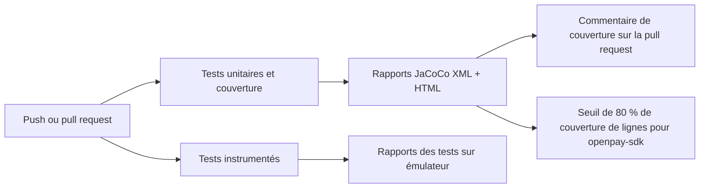

# Intégration continue

Le dépôt exécute un pipeline GitHub Actions (`.github/workflows/ci.yml`) à chaque push et pull request ciblant `develop` ou `master`. Vous n'avez rien à installer : GitHub l'exécute automatiquement quand vous ouvrez une pull request.

## Ce que fait le pipeline



### Tests unitaires et couverture

Ce job s'exécute à chaque push et pull request :

1. Compile le projet avec le JDK 17 et exécute `testDebugUnitTest` pour tous les modules.
2. Génère les rapports de couverture JaCoCo (`jacocoTestReport`).
3. Applique le minimum de 80 % de couverture de lignes sur `openpay-sdk` (`jacocoCoverageVerification`). Le build échoue quand la couverture passe sous ce seuil.
4. Sur les pull requests, publie (et maintient à jour) un commentaire avec la couverture globale et celle des fichiers modifiés par la pull request, via [Madrapps/jacoco-report](https://github.com/Madrapps/jacoco-report).
5. Téléverse les rapports HTML de couverture et de tests comme artefacts du build, afin que vous puissiez les télécharger et les consulter depuis la page de l'exécution.

### Tests instrumentés

Ce job démarre un émulateur Android 14 (API 34) sur le runner et exécute `connectedDebugAndroidTest`. L'émulateur a besoin de l'accélération matérielle, c'est pourquoi le job active KVM avant de le lancer. Les rapports de tests sont téléversés comme artefacts.

## Lire le commentaire de couverture

Chaque pull request reçoit un seul commentaire intitulé **Unit test coverage**, actualisé à chaque push. Il affiche :

- **La couverture globale** du projet, marquée d'un ✅ quand elle atteint 80 % ou plus.
- **La couverture des fichiers modifiés**, pour que les relecteurs voient si le nouveau code est testé sans ouvrir le rapport complet.

## Exécuter les mêmes vérifications en local

```bash
./gradlew testDebugUnitTest jacocoTestReport :openpay-sdk:jacocoCoverageVerification
./gradlew connectedDebugAndroidTest   # nécessite un appareil ou un émulateur
```

Le rapport HTML est généré dans `<module>/build/reports/jacoco/jacocoTestReport/html/index.html`.