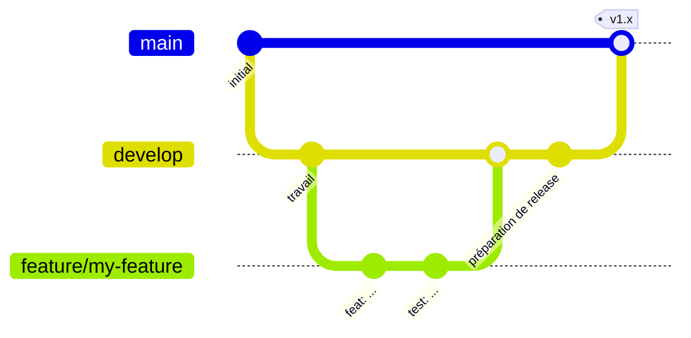

# Contribuer

Ce guide ne suppose **aucune expérience Android**. Suivez-le de haut en
bas et vous serez en mesure de compiler, tester et proposer des
modifications.

## 1. Préparer votre machine

1. Installez [Android Studio](https://developer.android.com/studio) (il
   inclut le JDK et le SDK Android).
2. Clonez le dépôt :
   ```bash
   git clone git@github.com:DEV1-Softworks/openpay-android.git
   cd openpay-android
   ```
3. Ouvrez le dossier dans Android Studio et laissez-le se synchroniser, ou
   travaillez entièrement depuis le terminal avec les commandes
   ci-dessous. Le projet télécharge automatiquement sa propre chaîne
   d'outils Gradle et JDK lors de la première compilation.

## 2. Commandes du quotidien

| Quoi | Commande |
|---|---|
| Tout compiler | `./gradlew assembleDebug` |
| Lancer tous les tests unitaires | `./gradlew testDebugUnitTest` |
| Rapport de couverture (HTML + XML) | `./gradlew :openpay-sdk:jacocoTestReport` |
| Faire respecter le seuil de couverture de 80 % | `./gradlew :openpay-sdk:jacocoCoverageVerification` |
| Installer l'application d'exemple sur un appareil | `./gradlew :app:installDebug` |
| Publier le SDK dans votre Maven local | `./gradlew :openpay-sdk:publishToMavenLocal` |

Le rapport de couverture est généré dans
`openpay-sdk/build/reports/jacoco/jacocoTestReport/html/index.html` —
ouvrez-le dans un navigateur.

## 3. Règles du projet

- **Langage** : Kotlin uniquement. L'interface est en Jetpack Compose ; le
  XML n'existe que pour l'interopérabilité avec l'existant.
- **Architecture** : clean architecture. Le code du domaine
  (`openpay-sdk/src/main/kotlin/.../domain`) ne doit importer aucun type
  Android ni Ktor.
- **Injection de dépendances** : Koin. Les définitions du SDK vivent dans
  les modules `di/` à l'intérieur du conteneur isolé `OpenpayKoinContext`.
- **Versions** : chaque version de dépendance vit dans
  `gradle/libs.versions.toml`, et nulle part ailleurs.
- **Nommage** : pas de noms ambigus. Les compteurs de boucle sont la seule
  exception.
- **Tests** : chaque modification s'accompagne de tests unitaires (JUnit +
  Mockito + Robolectric). La couverture de lignes doit rester à **80 % ou
  plus** — sinon la tâche `jacocoCoverageVerification` échoue. Lancez les
  tests avant chaque commit.

## 4. Flux de travail Git (Git Flow)



- `master` est la **production**. Rien n'y est poussé directement.
- `develop` est la branche d'intégration et la base de chaque
  fonctionnalité.
- Créez une branche par fonctionnalité : `feature/<nom-court>`.
- Ouvrez une **pull request vers `develop`** pour chaque modification, en
  privilégiant les petites PR aux grosses. Une PR doit compiler et passer
  `testDebugUnitTest` + `jacocoCoverageVerification`.
- Les releases fusionnent `develop` dans `master` via une PR de release.

## 5. Liste de vérification des pull requests

- [ ] Le code respecte les règles d'architecture et de nommage ci-dessus
- [ ] Le code nouveau/modifié a des tests, couverture ≥ 80 %
- [ ] `./gradlew testDebugUnitTest jacocoCoverageVerification` passe en local
- [ ] Les chaînes du SDK visibles par l'utilisateur existent dans **les
      quatre** langues (`values`, `values-es`, `values-pt`, `values-fr`)
- [ ] La documentation est à jour (les quatre langues sous `docs/`)
