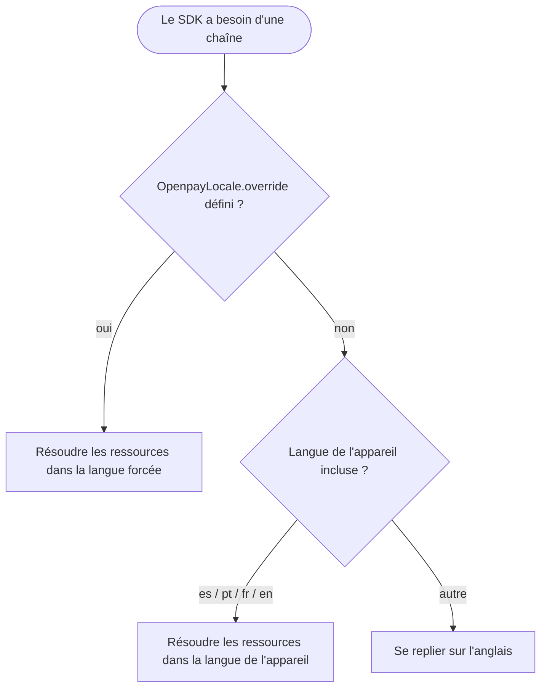

# Internationalisation

Chaque texte affiché par le SDK — libellés, erreurs de validation,
descriptions d'accessibilité — est disponible en :

| Langue | Tag |
|---|---|
| Anglais (par défaut et langue de repli) | `en` |
| Espagnol | `es` |
| Portugais | `pt` |
| Français | `fr` |

## Résolution automatique

Par défaut, le SDK suit la **langue de l'appareil**, y compris les
variantes régionales (`es-MX`, `pt-BR`, `fr-CA`, …). Les appareils
configurés dans toute autre langue basculent vers l'anglais. Il n'y a rien
à configurer.

## Forcer une langue

Certaines applications laissent les utilisateurs choisir une langue
indépendamment des réglages du système. Définissez le forçage une seule
fois et chaque composant du SDK à l'écran se met à jour immédiatement :

```kotlin
import mx.dev1.openpay.sdk.i18n.OpenpayLanguage
import mx.dev1.openpay.sdk.i18n.OpenpayLocale

OpenpayLocale.override = OpenpayLanguage.PORTUGUESE // forcer le portugais
OpenpayLocale.override = null                       // retour au mode automatique
```

Le forçage est un état Compose observable : les composables du SDK se
recomposent en direct quand il change, sans redémarrage nécessaire.

## Applications basées sur les vues

Si vous affichez des chaînes du SDK depuis votre propre code de vues,
résolvez-les via un contexte localisé :

```kotlin
val localizedContext = OpenpayLocale.localize(context)
val label = localizedContext.getString(R.string.openpay_card_number_label)
```

`localize` renvoie le contexte inchangé quand aucun forçage n'est défini.

## Flux



## Ajouter une langue

Les traductions vivent dans les ressources Android du SDK
(`openpay-sdk/src/main/res/values-<tag>/strings.xml`). Pour proposer une
nouvelle langue, copiez `values/strings.xml`, traduisez chaque entrée,
ajoutez le tag à `OpenpayLanguage` et ouvrez une pull request — voir
[Contribuer](contributing.md).
