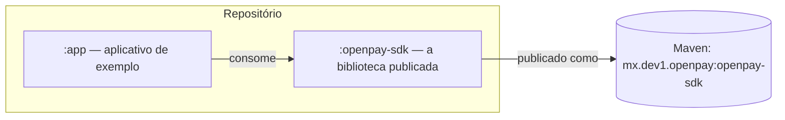
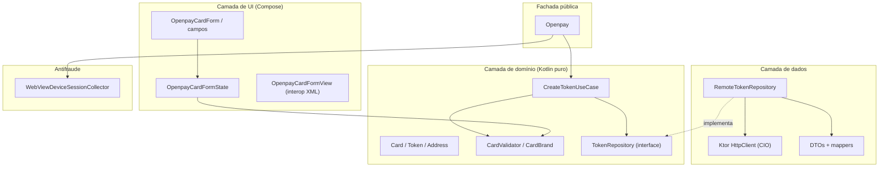
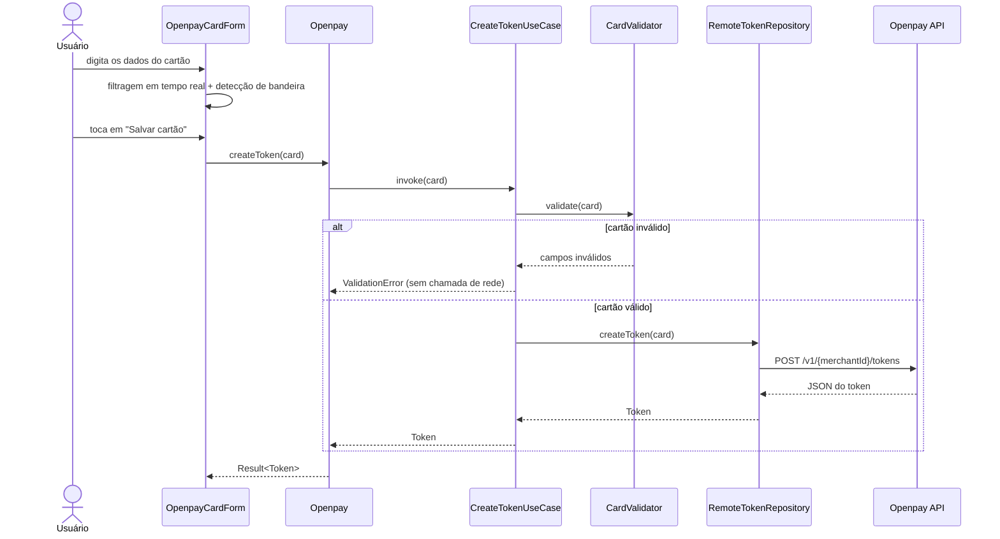
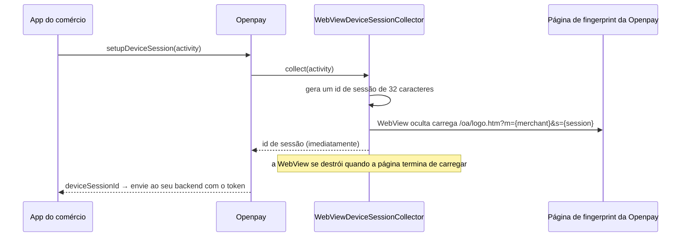

# Arquitetura

O SDK segue a **arquitetura limpa** (clean architecture): as regras de
domínio ficam no centro e nunca dependem do Android, da rede ou de qualquer
framework. As camadas externas dependem das internas, o que mantém a lógica
de negócio testável em testes JVM puros.

## Módulos

- **`:openpay-sdk`** — tudo o que o app de um comércio precisa: rede,
  tokenização, validação, antifraude, UI em Compose e traduções.
- **`:app`** — um exemplo executável que demonstra todos os recursos do SDK.

## Camadas dentro do SDK

Regras principais:

- A **camada de domínio** (`domain/`) não tem imports do Android.
  `CardValidator` e `CreateTokenUseCase` executam em milissegundos em
  qualquer JVM.
- A **camada de dados** (`data/`) implementa as interfaces do domínio usando
  Ktor e kotlinx.serialization. Trocar a pilha HTTP afetaria apenas esta
  camada.
- A **camada de UI** (`ui/`) é Compose em primeiro lugar. O wrapper XML
  existe apenas para apps hospedeiros legados.
- O **Koin** conecta tudo dentro de um contêiner *isolado*
  (`OpenpayKoinContext`), de modo que o SDK nunca entra em conflito com um
  app hospedeiro que também use Koin.

## Fluxo de tokenização

## Fluxo antifraude

## Mapa de pacotes

| Pacote | Conteúdo |
|---|---|
| `mx.dev1.openpay.sdk` | Fachada `Openpay`, `OpenpayCallback`, `OpenpaySdk` |
| `...sdk.core` | `OpenpayConfig`, países, ambientes, `OpenpayException` |
| `...sdk.domain.model` | `Card`, `Token`, `TokenizedCard`, `Address` |
| `...sdk.domain.validation` | `CardValidator`, `CardBrand`, `CardValidationResult` |
| `...sdk.domain.usecase` / `repository` | `CreateTokenUseCase`, `TokenRepository` |
| `...sdk.data` | Fábrica do cliente Ktor, DTOs, mappers, `RemoteTokenRepository` |
| `...sdk.antifraud` | Coleta da sessão do dispositivo |
| `...sdk.ui` | Tema, formulário, campos, transformações visuais, view XML |
| `...sdk.i18n` | `OpenpayLanguage`, substituição via `OpenpayLocale` |
| `...sdk.di` | Módulos Koin e o contêiner isolado |
