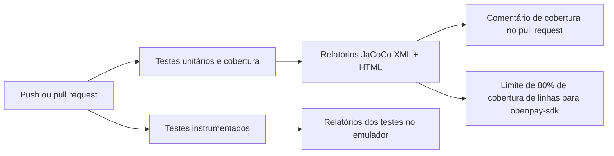
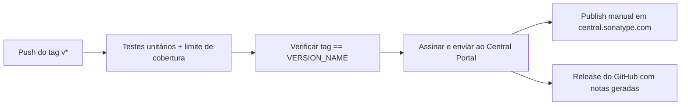

# Integração contínua

O repositório executa um pipeline do GitHub Actions (`.github/workflows/ci.yml`) em cada push e pull request direcionados a `develop` ou `master`. Você não precisa instalar nada: o GitHub o executa automaticamente quando você abre um pull request.

## O que o pipeline faz



### Testes unitários e cobertura

Este job é executado em cada push e pull request:

1. Compila o projeto com o JDK 17 e executa `testDebugUnitTest` em todos os módulos.
2. Gera os relatórios de cobertura do JaCoCo (`jacocoTestReport`).
3. Aplica o mínimo de 80% de cobertura de linhas no `openpay-sdk` (`jacocoCoverageVerification`). O build falha quando a cobertura fica abaixo desse limite.
4. Nos pull requests, publica (e mantém atualizado) um comentário com a cobertura geral e a cobertura dos arquivos alterados pelo pull request, usando [Madrapps/jacoco-report](https://github.com/Madrapps/jacoco-report).
5. Envia os relatórios HTML de cobertura e de testes como artefatos do build, para que você possa baixá-los e consultá-los na página da execução.

### Testes instrumentados

Este job inicia um emulador Android 14 (API 34) no runner e executa `connectedDebugAndroidTest`. O emulador precisa de aceleração por hardware, por isso o job habilita o KVM antes de iniciá-lo. Os relatórios de testes são enviados como artefatos.

## Como ler o comentário de cobertura

Cada pull request recebe um único comentário intitulado **Unit test coverage**, atualizado a cada push. Ele mostra:

- **Cobertura geral** do projeto, marcada com ✅ quando está em 80% ou mais.
- **Cobertura dos arquivos alterados**, para que os revisores vejam se o novo código está testado sem abrir o relatório completo.

## Executar as mesmas verificações localmente

```bash
./gradlew testDebugUnitTest jacocoTestReport :openpay-sdk:jacocoCoverageVerification
./gradlew connectedDebugAndroidTest   # requer um dispositivo ou emulador
```

O relatório HTML é gerado em `<módulo>/build/reports/jacoco/jacocoTestReport/html/index.html`.

## Deploy contínuo

Um segundo workflow (`.github/workflows/cd.yml`) libera a biblioteca no
Maven Central. Ele roda quando um tag de versão (`v1.2.3`) é enviado —
normalmente o tag do commit de merge de um release em `master` — e também
pode ser iniciado manualmente na aba Actions.



1. **Testes primeiro** — o release é bloqueado se os testes unitários ou o
   limite de cobertura de 80% falharem.
2. **Guarda de versão** — o workflow falha se o tag não corresponder ao
   `VERSION_NAME` em `gradle.properties`; um release com tag errado não
   consegue sair.
3. **Envio assinado** — os artefatos são assinados com PGP e enviados à
   área de staging do Central Portal da Sonatype. As credenciais e a chave
   de assinatura vêm dos secrets do repositório
   (`MAVEN_REPOSITORY_USERNAME`, `MAVEN_REPOSITORY_PASSWORD`,
   `SIGNING_KEY`, `SIGNING_PASSWORD`); elas nunca vivem no repositório.
4. **Confirmação manual** — nada se torna público automaticamente: uma
   pessoa mantenedora precisa pressionar **Publish** no deployment
   validado em [central.sonatype.com](https://central.sonatype.com). O
   resumo da execução aponta para essa etapa.
5. Um release do GitHub com notas geradas é criado para o tag.