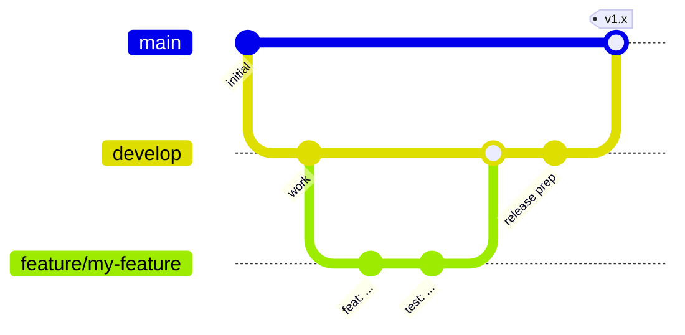

# Contribuindo

Este guia pressupõe **nenhuma experiência com Android**. Siga-o do início ao
fim e você será capaz de compilar, testar e propor mudanças.

## 1. Prepare sua máquina

1. Instale o [Android Studio](https://developer.android.com/studio) (ele já
   inclui o JDK e o Android SDK).
2. Clone o repositório:
   ```bash
   git clone git@github.com:DEV1-Softworks/openpay-android.git
   cd openpay-android
   ```
3. Abra a pasta no Android Studio e deixe-o sincronizar, ou trabalhe
   inteiramente pelo terminal com os comandos abaixo. O projeto baixa
   automaticamente seu próprio Gradle e a toolchain do JDK na primeira
   compilação.

## 2. Comandos do dia a dia

| O quê | Comando |
|---|---|
| Compilar tudo | `./gradlew assembleDebug` |
| Executar todos os testes unitários | `./gradlew testDebugUnitTest` |
| Relatório de cobertura (HTML + XML) | `./gradlew :openpay-sdk:jacocoTestReport` |
| Aplicar o limite de 80% de cobertura | `./gradlew :openpay-sdk:jacocoCoverageVerification` |
| Instalar o app de exemplo em um dispositivo | `./gradlew :app:installDebug` |
| Publicar o SDK no seu Maven local | `./gradlew :openpay-sdk:publishToMavenLocal` |

O relatório de cobertura é gerado em
`openpay-sdk/build/reports/jacoco/jacocoTestReport/html/index.html` — abra-o
em um navegador.

## 3. Regras do projeto

- **Linguagem**: apenas Kotlin. A UI é Jetpack Compose; o XML existe apenas
  para interoperabilidade legada.
- **Arquitetura**: arquitetura limpa. O código de domínio
  (`openpay-sdk/src/main/kotlin/.../domain`) não deve importar tipos do
  Android nem do Ktor.
- **Injeção de dependência**: Koin. As definições do SDK vivem em módulos
  `di/` dentro do contêiner isolado `OpenpayKoinContext`.
- **Versões**: toda versão de dependência vive em
  `gradle/libs.versions.toml`, em nenhum outro lugar.
- **Nomenclatura**: nada de nomes ambíguos. Contadores de laço são a única
  exceção.
- **Testes**: toda mudança vem acompanhada de testes unitários (JUnit +
  Mockito + Robolectric). A cobertura de linhas deve permanecer em **80% ou
  mais** — caso contrário, a tarefa `jacocoCoverageVerification` falha.
  Execute os testes antes de cada commit.

## 4. Fluxo de trabalho com Git (Git Flow)



- `master` é **produção**. Nada é enviado diretamente para ela.
- `develop` é a branch de integração e a base de toda feature.
- Crie uma branch por feature: `feature/<nome-curto>`.
- Abra um **pull request para `develop`** a cada mudança, preferindo PRs
  pequenos aos grandes. Um PR deve compilar e passar em `testDebugUnitTest`
  + `jacocoCoverageVerification`.
- As releases mesclam `develop` em `master` por meio de um PR de release.

## 5. Checklist do pull request

- [ ] O código segue as regras de arquitetura e nomenclatura acima
- [ ] Código novo/alterado tem testes, cobertura ≥ 80%
- [ ] `./gradlew testDebugUnitTest jacocoCoverageVerification` passa localmente
- [ ] As strings do SDK visíveis ao usuário existem em **todos os quatro**
      idiomas (`values`, `values-es`, `values-pt`, `values-fr`)
- [ ] Documentação atualizada (os quatro idiomas em `docs/`)
