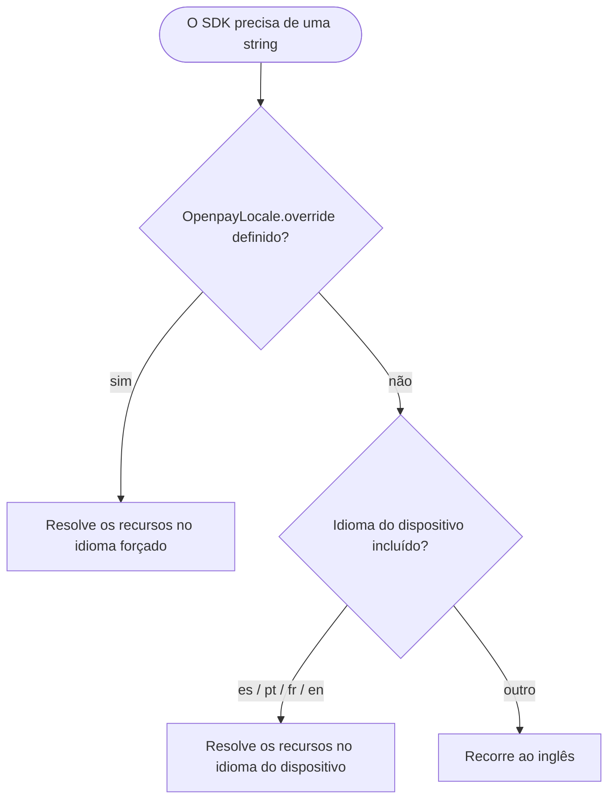

# Internacionalização

Todo texto que o SDK exibe — rótulos, erros de validação, descrições de
acessibilidade — está disponível em:

| Idioma | Tag |
|---|---|
| Inglês (padrão e fallback) | `en` |
| Espanhol | `es` |
| Português | `pt` |
| Francês | `fr` |

## Resolução automática

Por padrão, o SDK segue o **idioma do dispositivo**, incluindo variantes
regionais (`es-MX`, `pt-BR`, `fr-CA`, …). Dispositivos configurados em
qualquer outro idioma recorrem ao inglês. Não há nada a configurar.

## Forçando um idioma

Alguns apps permitem que os usuários escolham um idioma independentemente
das configurações do sistema. Defina a substituição uma vez e todos os
componentes do SDK na tela são atualizados imediatamente:

```kotlin
import mx.dev1.openpay.sdk.i18n.OpenpayLanguage
import mx.dev1.openpay.sdk.i18n.OpenpayLocale

OpenpayLocale.override = OpenpayLanguage.PORTUGUESE // força o português
OpenpayLocale.override = null                       // volta ao automático
```

A substituição é um estado observável do Compose: os composables do SDK
recompõem ao vivo quando ela muda, sem necessidade de reiniciar.

## Apps baseados em views

Se você exibe strings do SDK a partir do seu próprio código de views,
resolva-as por meio de um contexto localizado:

```kotlin
val localizedContext = OpenpayLocale.localize(context)
val label = localizedContext.getString(R.string.openpay_card_number_label)
```

`localize` retorna o contexto sem alterações quando nenhuma substituição
está definida.

## Fluxo



## Adicionando um idioma

As traduções vivem nos recursos Android do SDK
(`openpay-sdk/src/main/res/values-<tag>/strings.xml`). Para propor um novo
idioma, copie `values/strings.xml`, traduza todas as entradas, adicione a
tag em `OpenpayLanguage` e abra um pull request — veja
[Contribuindo](contributing.md).
